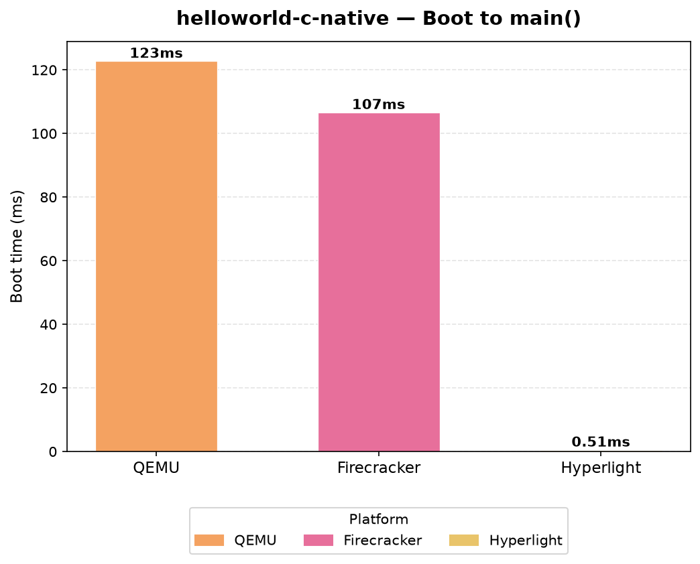
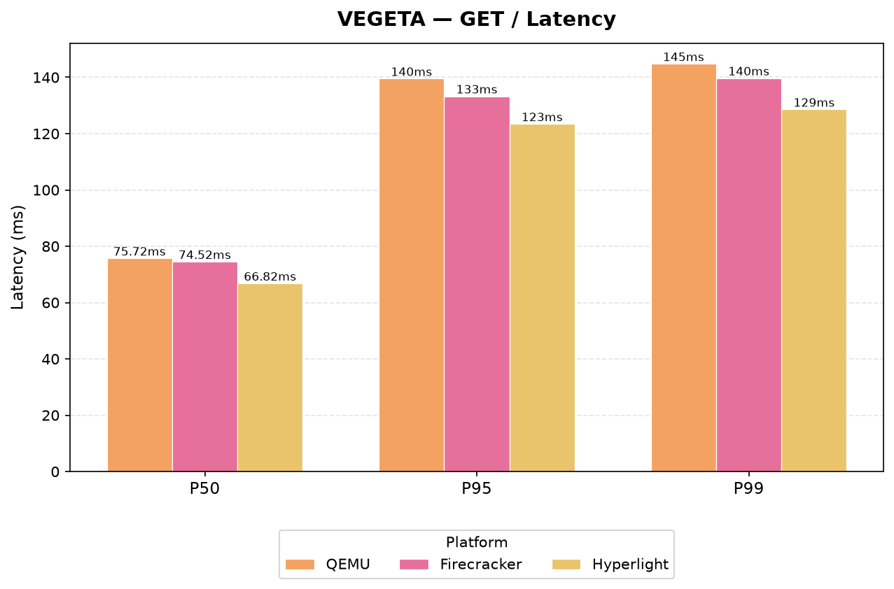
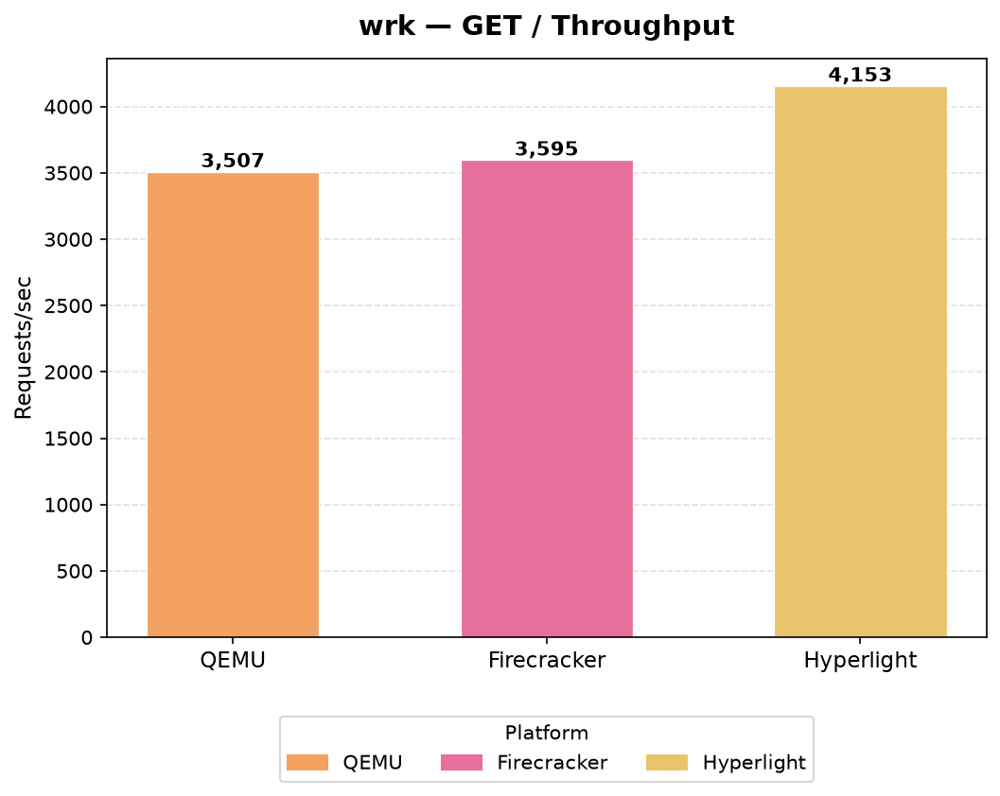

# Unikraft GSoC'26: Add KraftKit Support for Hyperlight


## Project Overview

[Hyperlight](https://github.com/hyperlight-dev/hyperlight) is a lightweight micro-VM / sandbox runtime.
It gives you an ultra-secure environment with ultra-fast boot times: the host exposes a small set of functions, and the guest can only call those.

To me, Unikraft and Hyperlight look similar, in Unikraft you cherry-pick the kernel components you need, and in Hyperlight you cherry-pick the host functions the guest is allowed to call.
This project brings the two together, so you can run Unikraft unikernels with Hyperlight using [KraftKit](https://github.com/unikraft/kraftkit).

The GSoC idea is documented in [ideas.md](../../ideas.md) and tracked as [kraftkit#2636](https://github.com/unikraft/kraftkit/issues/2636).
KraftKit already had QEMU, Firecracker, and Xen.
The goal was to add a fourth platform — a `machine/hyperlight` driver to make the `kraft run --plat hyperlight` work.

[Dan Chiarlone](https://github.com/danbugs) (Hyperlight maintainer) started the driver and maintains [`hyperlight-unikraft`](https://github.com/hyperlight-dev/hyperlight-unikraft), the host binary that actually launches the micro-VM.
I continued that work mapping KraftKit flags and config onto Hyperlight, then adding networking, volumes, lifecycle handling, tests, CI, a pre-built base runtime, and catalog examples.

## GSoC Contributor

Name: Jaidev Singh

Email: <hi@jaidev.me>

Github profile: [ijaidev](https://github.com/ijaidev)

## Mentors

* [Cezar Craciunoiu](https://github.com/craciunoiuc)
* [Alex-Andrei Cioc](https://github.com/nurof3n)

## Contributions

Most of the work landed in [KraftKit](https://github.com/unikraft/kraftkit), with examples and a base runtime in the Unikraft [catalog](https://github.com/unikraft/catalog), and a few posts in [docs](https://github.com/unikraft/docs).

The driver runs each machine as a detached `hyperlight-unikraft` child process.
That means `kraft ps`, `kraft logs`, `kraft stop`, and `kraft rm` work across separate `kraft` invocations, the same way they do for Firecracker.

### Hyperlight machine driver

The driver lives in [`machine/hyperlight/`](https://github.com/unikraft/kraftkit/tree/staging/machine/hyperlight).
It registers both `hyperlight` and the `hl` shorthand, so either works with `--plat`.

This is what I did in the driver:

- Added Hyperlight-specific run flags: `--hyperlight-stack`, `--hyperlight-quiet`, `--hyperlight-enable-tools`, `--hyperlight-net`, `--hyperlight-net-allow`, `--hyperlight-net-block`, `--hyperlight-repeat`, `--hyperlight-mount`, `--hyperlight-exec`
- Validated inputs early, so unsupported KraftKit options (emulation, network attachments, runtime env injection, kernel args, read-only / non-`9pfs` volumes) fail with a clear error instead of launching a broken host process
- Accepted platform aliases in machine commands, so `hl` is stored as the canonical `hyperlight` name
- Mapped writable `9pfs` host directories to `hyperlight-unikraft --mount HOST:GUEST`
- Passed rootfs / initrd CPIO archives as `--initrd`
- Mapped guest ports (`--port GUEST:GUEST`) and sandbox network policy (`--hyperlight-net-allow` / `--hyperlight-net-block`, which are mutually exclusive)
- Hardened lifecycle handling: log following after the machine exits, watch-mode terminal state, and pause/cleanup (`kraft pause` is not supported — Hyperlight has no pause semantics)

The first platform PR is [kraftkit#2823](https://github.com/unikraft/kraftkit/pull/2823).
Guest networking followed in [kraftkit#2844](https://github.com/unikraft/kraftkit/pull/2844).
Official support was merged in [kraftkit#2888](https://github.com/unikraft/kraftkit/pull/2888) and shipped in [`v0.12.15`](https://github.com/unikraft/kraftkit/releases/tag/v0.12.15).

A typical run looks like:

```bash
kraft build --plat hyperlight --arch x86_64
kraft run --plat hyperlight --hyperlight-net --port 8080:8080
```

### Tests

After the first stage, I mostly checked Hyperlight by hand against catalog examples.
That is fine for initial development, but we needed tests so the driver stays reliable as KraftKit and `hyperlight-unikraft` keep changing.

#### Unit tests

The suite in [kraftkit#2872](https://github.com/unikraft/kraftkit/pull/2872) sits next to the driver under `machine/hyperlight/`.
They are plain Go table-driven tests, and they cover:

- `HyperlightConfig.MarshalArgs` - how KraftKit turns config into host CLI args (memory, stack, networking, ports, initrd, mounts, repeat, exec, app args)
- Runtime validation - stack parsing, mutually exclusive net allow/block lists, guest port ranges, reserved mount paths (`/`, `/bin`, `/usr`, …), and kernel/initrd path checks
- Port and volume mapping from the generic machine API — same-port guest listens are accepted; host→guest forwarding, non-`0.0.0.0` binds, and non-TCP ports are rejected
- `Create` / `Start` behavior, including a stub `hyperlight-unikraft` on `$PATH` so Create can finish without talking to KVM

#### End-to-end tests

The suite in [kraftkit#2878](https://github.com/unikraft/kraftkit/pull/2878) lives under `test/e2e/cli/hyperlight/` and uses KraftKit's existing Ginkgo/Gomega framework:

- Skip cleanly unless Linux, `/dev/kvm`, `hyperlight-unikraft`, and Docker are available
- Check that `kraft run --help` exposes `--hyperlight-stack`, `--hyperlight-repeat`, and `--hyperlight-net`
- Walk a full Go HTTP unikernel workflow: `kraft build` → `kraft run` → `kraft ps` → `kraft logs` → `curl http://localhost:8080/` → `kraft stop` → `kraft rm`

#### CI

I added `hyperlight-unikraft` to the KraftKit GitHub Action image and wired it into the `e2e-cli` job ([kraftkit#2885](https://github.com/unikraft/kraftkit/pull/2885), [kraftkit#2905](https://github.com/unikraft/kraftkit/pull/2905)):

- Install `hyperlight-unikraft` in the GitHub Action image
- Set up Rust in the `e2e-cli` workflow, cache the host binary, grant `/dev/kvm` access, and run the Hyperlight suite

### `base-hyperlight` runtime and catalog examples

Unikraft's secret sauce is compiling a kernel tailored to one application.
During rapid development, though, you want instant startup - pull a pre-built ELF-loader runtime and run the binary.

[`library/base-hyperlight`](https://github.com/unikraft/catalog/tree/main/library/base-hyperlight) ([catalog#285](https://github.com/unikraft/catalog/pull/285)) is that runtime for `plat: hyperlight`, `arch: x86_64`.
It packages `app-elfloader` with the POSIX pieces modern compilers expect: `hostfs`, `hostsock`, `cpiovfs`, threading, signals, futexes, `mmap`, `execve`, and environment variables.

The catalog workflow now builds and publishes the `hyperlight/x86_64` base image alongside `qemu/x86_64` and `fc/x86_64`.
The published OCI image is `unikraft.org/base:latest`; you pick Hyperlight with `platform: hyperlight`.

```yaml
spec: v0.7

name: httpserver-gcc13.2-hyperlight

runtime: base:latest

targets:
  - platform: hyperlight
    architecture: x86_64

rootfs: ./rootfs.cpio

cmd: ["/http_server"]
```

or:

```bash
kraft run --rootfs rootfs.cpio --plat hyperlight unikraft.org/base:latest -- /bin
```

I also added examples under [`examples/hyperlight/`](https://github.com/unikraft/catalog/tree/main/examples/hyperlight):

- Helloworlds and servers from [catalog#281](https://github.com/unikraft/catalog/pull/281): C, Rust, Go, Python, Zig, Node.js, .NET, PowerShell, plus hostfs and networking
- An async Go HTTP server with wrk/vegeta scripts ([catalog#284](https://github.com/unikraft/catalog/pull/284))
- Base-runtime examples ([catalog#287](https://github.com/unikraft/catalog/pull/287)): C HTTP (`httpserver-gcc13.2`), Rust HTTP (`httpserver-rust1.75`), and Zig hello (`helloworld-zig0.11`)

### Supporting KraftKit fixes

Getting Hyperlight working also turned up a few gaps in the generic run/build path.
These are not Hyperlight-only, but they unblocked real `kraft run --plat hyperlight` workflows:

- [kraftkit#2834](https://github.com/unikraft/kraftkit/pull/2834) - default empty rootfs type to CPIO
- [kraftkit#2837](https://github.com/unikraft/kraftkit/pull/2837) - honor `--no-rootfs` when building rootfs
- [kraftkit#2851](https://github.com/unikraft/kraftkit/pull/2851) - kernel path and CLI `--outdir` priority
- [kraftkit#2861](https://github.com/unikraft/kraftkit/pull/2861) - rootfs artifact path and `--rootfs` CLI build
- [kraftkit#2873](https://github.com/unikraft/kraftkit/pull/2873) - absolute workdir and existing rootfs validation
- [kraftkit#2886](https://github.com/unikraft/kraftkit/pull/2886) - rootfs handling in `kraft run` and initrd

## Benchmarks

Here is how Hyperlight compared to QEMU and Firecracker while the driver was coming together.

I tested boot time with the [native C helloworld unikernel](https://github.com/unikraft/catalog/tree/main/examples/hyperlight/helloworld-c-native).
Hyperlight was around 246x faster than QEMU and 214x faster than Firecracker:



For networking I used a [Go HTTP server](https://github.com/unikraft/catalog/tree/main/examples/hyperlight/httpserver-go1.21) with Vegeta and wrk.
Async networking was still in development at the time, so these numbers are from sync/blocking networking.
Async is supported now.





These numbers are not exhaustive, and they will move with the unikernel, the workload, and the machine.
They are still a useful first look to give you an idea.

## Blog Posts

I wrote my progress in this project in a 3 part series on the Unikraft blog:

- [Part I](https://unikraft.org/blog/2026-06-19-unikraft-gsoc-hyperlight-platform) - machine driver, volumes, networking, lifecycle, and benchmarks ([docs#563](https://github.com/unikraft/docs/pull/563))
- [Part II](https://unikraft.org/blog/2026-07-14-unikraft-gsoc-hyperlight-platform-2) - unit and end-to-end tests ([docs#571](https://github.com/unikraft/docs/pull/571))
- [Part III](https://unikraft.org/blog/2026-08-05-unikraft-gsoc-hyperlight-platform-3) - upstream merge, `base-hyperlight`, CI, and polyglot examples ([docs#575](https://github.com/unikraft/docs/pull/575))

## Documentation

Driver requirements, supported flags, and current limitations are in [`machine/hyperlight/README.md`](https://github.com/unikraft/kraftkit/blob/staging/machine/hyperlight/README.md).

Catalog examples: https://github.com/unikraft/catalog/tree/main/examples/hyperlight

## Current Status

The Hyperlight platform is upstream in KraftKit and available as of [`v0.12.15`](https://github.com/unikraft/kraftkit/releases/tag/v0.12.15).

>The kernel side is not merged yet.
>Hyperlight support in Unikraft core and `app-elfloader` still lives on `plat-hyperlight` branches, not on `staging`:
>
>- [`unikraft` `plat-hyperlight`](https://github.com/unikraft/unikraft/tree/plat-hyperlight)
>- [`app-elfloader` `plat-hyperlight`](https://github.com/unikraft/app-elfloader/tree/plat-hyperlight)
>
>So KraftKit can already build and run Hyperlight guests, but those kernels still come from the unmerged platform branches.

What works today:

- `kraft build` / `kraft run` / `kraft ps` / `kraft logs` / `kraft stop` / `kraft rm` with `--plat hyperlight` (or `--plat hl`)
- Memory, stack, initrd/rootfs, writable directory mounts, guest ports, and sandbox network policy
- Unit tests, e2e tests, and CI that actually runs Hyperlight
- A published `base:latest` runtime and catalog examples spanning C, Rust, Zig, Go, Python, .NET, and Node.js

Hyperlight Unikraft host itself still has some limits.
The driver rejects those with a clear error:

- `kraft pause` - Hyperlight has no pause semantics
- Runtime environment injection (`--env`, Kraftfile `env:`, Dockerfile/OCI env)
- Network attachments (`--network`, `--ip`, `--mac`) and host port forwarding
- Emulation mode and kernel arguments
- Read-only volumes and non-`9pfs` volume drivers

## Future Work

- Land Hyperlight platform support in Unikraft core and `app-elfloader` (`plat-hyperlight` → `staging`)
- Expand e2e coverage for volumes/mounts, net allow/block policy, and more catalog examples
- Cover new Hyperlight runtime surfaces as `hyperlight-unikraft` grows
- Keep documentation and examples aligned with the tested CLI surface

I plan to keep connected to this project after GSoC, to make KraftKit more robust and to help the open source community.
Hyperlight is still moving fast, and pairing it with Unikraft is the interesting part.

## Main Takeaways

Over the summer we went from zero Hyperlight support in KraftKit to:

- A machine driver that maps KraftKit onto `hyperlight-unikraft`
- Unit tests that lock the driver down without KVM, and e2e tests that walk the real user path
- CI images and workflows that can build and run Hyperlight targets
- A pre-built ELF-loader runtime and catalog examples in several languages

## Acknowledgements

I want to thank my mentors, [Cezar Craciunoiu](https://github.com/craciunoiuc) and [Alex-Andrei Cioc](https://github.com/nurof3n), for the reviews, the advice, and the patience.
Special thanks to [Dan Chiarlone](https://github.com/danbugs) for the Hyperlight host, the initial KraftKit scaffolding, and working with us on this project.

This work would not have been possible without the Unikraft and Hyperlight communities.
I'm glad to have been a part of it.
